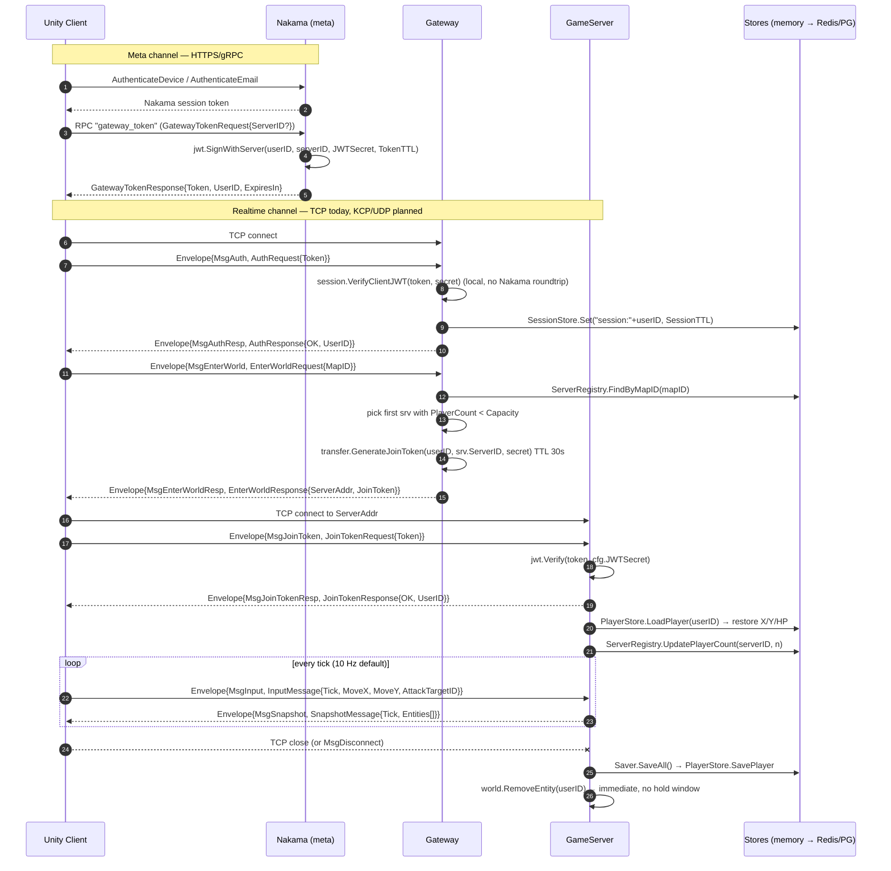

# Core Flow — End-to-End Tech Stack

Canonical reference for how a player goes from cold start to gameplay, and what the
backend actually does per tick. Every statement about current behavior was read out of
the code at the referenced `path:line`.

**Status legend**

| Mark | Meaning |
|------|---------|
| ✅ | Implemented and exercised by tests |
| 🟡 | Partial — type/scaffold exists, not wired into the runtime path, or hardcoded |
| ⬜ | Planned — no code yet |

MVP baseline: **TCP + length-prefixed JSON + in-memory stores**. Production targets
(KCP, Protobuf, Redis, PostgreSQL, Agones runtime) plug in behind the interfaces listed
in §5.

---

## 1. Login → Gameplay

### 1.1 Sequence



### 1.2 Step detail

| # | Step | Where | Status |
|---|------|-------|--------|
| 1 | Device/email auth against Nakama | Nakama built-in (`deploy/docker-compose.yml` runs `heroiclabs/nakama:3.40.0` + our plugin) | 🟡 stack up, plugin auth hooks in progress |
| 2 | `gateway_token` RPC issues an HS256 JWT with the **shared** secret | `nakama/auth/token.go:31` `IssueGatewayToken`, RPC id `gateway_token` (`token.go:14`) | 🟡 handler written, module registration/`InitModule` not yet present |
| 3 | Client opens realtime socket to Gateway | `gateway/server/server.go:48` `net.Listen("tcp", addr)` | ✅ TCP / ⬜ KCP |
| 4 | `MsgAuth` → JWT verified locally | `gateway/server/server.go:130` → `gateway/session/jwt.go:8` → `shared/jwt/jwt.go:66` | ✅ |
| 5 | Session record written | `gateway/session/manager.go:24`, key `session:{user_id}`, TTL `constants.SessionTTL` = 1h | ✅ write / 🟡 never read back (see gaps) |
| 6 | `MsgEnterWorld` → registry lookup + capacity filter | `gateway/transfer/map_assign.go:17` → `gateway/registry/registry.go:22` | ✅ |
| 7 | Join token minted, TTL `constants.JoinTokenTTL` = 30s, carries `sid` (server id) claim | `gateway/transfer/join_token.go:12`, `shared/jwt/jwt.go:39` | ✅ |
| 8 | Client connects **directly** to the game server addr | `integration_test/integration_test.go:322` | ✅ |
| 9 | `MsgJoinToken` handshake; must be the first frame on the socket | `gameserver/server/server.go:138-181` | ✅ |
| 10 | Player entity created (HP 100, Attack 10, Defense 5, Speed 1.0) then overwritten by `LoadPlayer` if state exists | `gameserver/server/server.go:183-202` | ✅ |
| 11 | Input/snapshot loop | §2 | ✅ |
| 12 | Disconnect → `SaveAll` → entity removed | `gameserver/server/server.go:214-222` | 🟡 no reconnect hold |

### 1.3 Wire format

- Framing: 4-byte big-endian length prefix + JSON `Envelope{type, payload}`, 1 MB max frame — `shared/messages/codec.go:11,23,30`. ✅
- Message ids: `MsgAuth=1 … MsgDisconnect=9` — `shared/messages/messages.go:6-16`. ✅
- Payload is a nested JSON blob (`Envelope.Payload []byte` → base64 in JSON). Protobuf swap replaces `Encode`/`Decode` + payload marshalers only. ⬜

### 1.4 Disconnect / reconnect

| Behavior | Intended | Actual |
|----------|----------|--------|
| Map hold window | `constants.EntityHoldTTL` = 30s | ⬜ constant declared (`shared/constants/ttl.go:7`), **no reader** — `server.go:218` removes the entity immediately |
| Dungeon hold window | `constants.DungeonHoldTTL` = 60s | ⬜ same, unused |
| Reconnect | Re-handshake with session token | 🟡 works only as a fresh join; state is recovered via `PlayerStore.LoadPlayer` (`server.go:195`), not via a held entity |
| Gateway `MsgDisconnect` | Close + destroy session | ⬜ Gateway `handleMessage` (`server.go:119`) handles only `MsgAuth`/`MsgEnterWorld`; `DestroySession` is never called |

---

## 2. Tick loop internals

Owner: `gameserver/server/tick.go`. Started at `gameserver/server/server.go:110`, rate from
`config.TickRate` (env `TICK_RATE`, default 10; `constants.DefaultTickRate=10`, `Max=15`, `Min=5`).

```
net read goroutine (per conn)          tick goroutine (1/server)              saver goroutine (1/server)
  Connection.ReadLoop                    every 1s/TickRate:                     every 30s:
  → onMessage(MsgInput)                    1 world.DrainInputs()                  SaveAll()
  → world.PushInput(userID, input) ──────► 2 handler.ProcessInput per input       → PlayerStore.SavePlayer
     (appends to World.pending)            3 per connection:
                                              GetNearbyEntities(AOI r=50)
                                              EncodeSnapshot(tick, entities)
                                              conn.Send(MsgSnapshot) ──► WriteLoop
```

| Stage | Code | Notes | Status |
|-------|------|-------|--------|
| Ingest | `gameserver/server/server.go:225` `onMessage` → `game/world.go:92` `PushInput` | Inputs queue on `World.pending` under mutex; unbounded, no per-tick rate cap | ✅ |
| Drain | `server/tick.go:68` `world.DrainInputs()` | All queued inputs for the interval are applied in one tick, in arrival order | ✅ |
| Validate | `input/validator.go:18` `ValidateMove` (speed hack: `dist > 5.0 * entity.Speed` → `ErrSpeedHack`), `input/validator.go:31` `ValidateAttack` (nil/dead target, `attackRange=3.0` → `ErrOutOfRange`, `CooldownUntil` → `ErrCooldown`) | Rejections are logged at Debug and silently dropped — no error frame to the client | ✅ |
| Apply | `input/handler.go:26` `ProcessInput` | Movement is `X += MoveX` (delta, not a target position). Attack: `combat.CalculateDamage` (`Attack - Defense`, min 1) → `target.HP -= dmg` → `entity.CooldownUntil = now + 500ms` → `combat.HandleDeath` | ✅ |
| World update | — | ⬜ **No separate simulation step**: no NPC/AI, no physics integration, no regen, no respawn, no timers. The world only changes as a direct result of player input | ⬜ |
| AOI | `snapshot/aoi.go:8` → `game/world.go:52` `GetEntitiesInRange` | Brute-force O(n) scan per player per tick ⇒ O(n²)/tick. Radius hardcoded `50.0` at `server/tick.go:32` and `snapshot/aoi.go:5` | 🟡 |
| Encode | `snapshot/encoder.go:8` `EncodeSnapshot` | Full state every tick — `{ID,Type,X,Y,HP,MaxHP}`. No delta/baseline, no interest-change events | ✅ full / ⬜ delta |
| Send | `server/connection.go:34` `Send` → buffered chan (cap 64) → `WriteLoop` | Non-blocking w.r.t. the tick; a slow client silently drops nothing but blocks on the chan until `done` | ✅ |
| Persist | `persistence/saver.go:35` `Run` | Interval hardcoded `30*time.Second` at `server/server.go:114`; final flush on `Stop()` and on every disconnect (`server.go:217`) | ✅ |

`InputMessage.Tick` is carried on the wire (`messages.go:64`) but **never read** by the
server — no sequence check, no client-prediction reconciliation, no replay. `TickRunner.tick`
is the only authority and only ever increments (`tick.go:65`).

---

## 3. Cross-server events & dungeon transfer

### 3.1 Event plumbing

| Piece | Code | Status |
|-------|------|--------|
| `storage.EventStream` interface (`Publish`/`Subscribe`/`Close`) | `shared/storage/interfaces.go:60` | ✅ |
| `MemoryEventStream` — in-process fan-out to handler funcs, no ACK, no replay | `shared/storage/memory.go:145-181` | ✅ |
| `gameserver/events.Publisher` — thin wrapper that logs publish errors | `gameserver/events/publisher.go:17` | 🟡 **never constructed**; `ServerOpts.EventStream` (`server/server.go:46`) is accepted and then dropped on the floor — `Server` has no event stream field |
| `gateway/events.EventRelay` + `StubEventRelay` | `gateway/events/relay.go:10,18` | ⬜ `Start` returns `ErrNotImplemented`; never instantiated by `cmd/gateway` |
| Redis Streams w/ consumer-group ACK | — | ⬜ planned; key prefix reserved: `constants.EventStreamPrefix = "events:"` (unused) |

Net: **no cross-server event actually flows today.** Everything is single-process.

### 3.2 Dungeon transfer

| Piece | Code | Status |
|-------|------|--------|
| `transfer.DungeonTransfer` interface `Transfer(ctx, partyID, dungeonID) (AssignResult, error)` | `gateway/transfer/dungeon.go:10` | ✅ shape |
| `StubDungeonTransfer` | `gateway/transfer/dungeon.go:19` — always `ErrNotImplemented` | ⬜ |
| `registry.Allocator` / `StubAllocator` (would call Agones `GameServerAllocation`) | `gateway/registry/allocator.go:11,20` — always `ErrNotImplemented`, not wired into `Gateway` | ⬜ |
| Dungeon-mode game server | `cmd/gameserver/main.go` `--mode=dungeon` flag exists but only feeds the default `server-id`; **no behavioral difference** from map mode | 🟡 |
| Fleet with `replicas: 0`, allocate-on-demand | `deploy/agones/fleet-dungeon.yaml` | ✅ manifest / ⬜ nothing calls allocation |

Planned lifecycle (unimplemented): allocate instance → checkpoint save → issue join tokens to
the party → gameplay → loot/fail → final save → transfer back to origin map → `SDK.Shutdown()`
→ pod reclaimed after idle.

### 3.3 Agones lifecycle (the one orchestration piece that *is* wired)

| Hook | Code | Status |
|------|------|--------|
| `agones.SDK` interface (`Ready`/`Shutdown`/`Allocate`/`Health`) | `gameserver/agones/sdk.go:12` | ✅ |
| `RealSDK` over `agones.dev/agones/sdks/go`, `NoopSDK` for local dev | `sdk.go:24,75` | ✅ |
| `Ready()` on listen + 2s health ping loop | `server/server.go:102-107`, `agones/sdk.go:59` | ✅ |
| `Shutdown()` on graceful stop | `server/server.go:244-249` | ✅ |
| `Allocate()` | implemented on the SDK, **never called** — nothing self-allocates | 🟡 |

---

## 4. Deployment topology per tier

Common to all tiers: two channels — meta over HTTPS/WS to Nakama, realtime over TCP (→KCP)
to Gateway/GameServers. All components are open source, $0 license.

| Tier | ~$/mo | CCU | Topology |
|------|-------|-----|----------|
| **Dev / Alpha** | 40–60 | <200 | 1 VPS, all-in-one. Today: `deploy/docker-compose.yml` brings up PostgreSQL 16 + Nakama 3.40 (+ our plugin at `/nakama/data/modules`); gateway and gameserver run on the host via `go run`. `pg_dump` daily. |
| **Beta** | 80–150 | 200–500 | 2 VPS: app (Nakama + Gateway + game servers) / DB (PostgreSQL + Redis). CDN for assets, Grafana + Prometheus (Nakama already exposes `:9100`). |
| **Soft Launch** | 200–400 | 500–2000 | 3 VPS: (Nakama + Gateway) / game servers on k3s+Agones / dedicated DB + Redis. Map fleet `replicas: 2` with a Buffer autoscaler (`deploy/agones/autoscaler.yaml`: buffer 2, min 1, max 10). Dungeon fleet scales from 0. |
| **Growth** | 400–1000+ | 2000–5000+ | Multi-node k3s, Agones fleets per map region, Redis Sentinel, optional managed PostgreSQL, read replicas. k3s over full K8s: ~500 MB vs 2 GB+ control plane. |

Game-server pod budget (`deploy/agones/fleet-map.yaml`): request 64Mi/100m, limit 128Mi/500m,
port 9000 TCP (`protocol: TCP  # Switch to UDP for KCP in production`), health probe 5s period /
3 failures — matched by the 2s ping loop in `agones/sdk.go:106`.

Ports: Nakama 7349 gRPC / 7350 HTTP / 7351 console / 9100 metrics; Gateway `:8000`
(`GATEWAY_ADDR`); GameServer `:9000` (`GAMESERVER_ADDR`).

---

## 5. Extension seams (MVP → production)

Every swap below is a constructor change at a `cmd/` entry point — no business logic moves.

| Layer | MVP (current) | Production target | Seam (exact Go symbol) |
|-------|---------------|-------------------|------------------------|
| Transport | TCP `net.Listen` | KCP/UDP (`xtaci/kcp-go`) | `net.Conn` only — `gameserver/server/connection.go:13`, `gateway/server/connection.go` `ClientConn`. Both wrap a bare `net.Conn` with `ReadLoop`/`WriteLoop` |
| Framing / encoding | 4-byte length prefix + JSON | Protobuf / FlatBuffers | `messages.Encode` / `messages.Decode` / `messages.NewEnvelope` / `messages.UnmarshalPayload` — `shared/messages/codec.go` |
| Player state | `storage.MemoryPlayerStore` | PostgreSQL via `pgx` | `storage.PlayerStore` — `shared/storage/interfaces.go:38` (`SavePlayer`/`LoadPlayer`/`DeletePlayer`) |
| Sessions | `storage.MemorySessionStore` | Redis (`go-redis`), key `session:{user_id}` | `storage.SessionStore` — `interfaces.go:45` (already TTL-aware: `Set(ctx,key,val,ttl)`) |
| Server registry | `storage.MemoryServerRegistry` | Redis hash, key prefix `servers:` | `storage.ServerRegistry` — `interfaces.go:52` |
| Event stream | Go channels / direct callback | Redis Streams + consumer-group ACK | `storage.EventStream` — `interfaces.go:60`; relay side `gateway/events.EventRelay` |
| Server allocation | first-fit over registry | Agones `GameServerAllocation` | `registry.Allocator` — `gateway/registry/allocator.go:11` |
| Dungeon transfer | none | party checkpoint + instance handoff | `transfer.DungeonTransfer` — `gateway/transfer/dungeon.go:10` |
| Agones runtime | `agones.NoopSDK` | `agones.RealSDK` (`--agones` flag) | `agones.SDK` — `gameserver/agones/sdk.go:12` |
| JWT | hand-rolled HS256 | `golang-jwt/jwt/v5` | `shared/jwt` `Sign`/`SignWithServer`/`Verify` |
| AOI | brute-force radius scan | spatial grid / quadtree | `game.World.GetEntitiesInRange` — `gameserver/game/world.go:52`, called only via `snapshot.GetNearbyEntities` |
| Config | env vars w/ defaults | same + secret manager | `config.Config` / `config.Load()` — `shared/config/config.go:31` (`MetaDBURL`, `GameStateDBURL`, `RedisAddr` already declared, unused) |

---

## 6. Known gaps between docs and code

Read this before trusting any higher-level diagram.

1. **The Gateway does not relay realtime traffic.** It is a redirector: authenticate → hand
   back `{ServerAddr, JoinToken}` → the client opens a *second* socket straight to the game
   server (`integration_test.go:322`). Root `README.md` (`Gateway ──→ Game Servers`) reads as
   a proxy; it isn't one.
2. **Registry is per-process in-memory.** `cmd/gateway/main.go` and `cmd/gameserver/main.go`
   each build their *own* `storage.NewMemoryServerRegistry()`. The two-terminal quick start in
   `README.md` therefore cannot complete `MsgEnterWorld` — the gateway sees an empty registry.
   E2E only passes because `integration_test.go` shares one store in-process. Fix = Redis registry.
3. **Join token `sid` claim is not enforced.** `gameserver/server/server.go:159` verifies the
   signature and reads `claims.UserID` but ignores `claims.ServerID` — a token minted for
   server A is accepted by server B.
4. **JWT header `alg` is not validated.** `shared/jwt/jwt.go:66` splits, recomputes HMAC-SHA256
   and compares; `parts[0]` is never decoded or checked.
5. **Sessions are write-only.** `CreateSession` is called on auth; `ValidateSession` and
   `DestroySession` have no callers outside tests.
6. **Reconnect hold windows do not exist.** `EntityHoldTTL` / `DungeonHoldTTL` are declared
   and unreferenced; entities are removed on TCP close.
7. **Events are dead wiring.** `ServerOpts.EventStream` is accepted and never stored;
   `events.NewPublisher` has zero callers; both stubs (`StubEventRelay`, `StubAllocator`,
   `StubDungeonTransfer`) return `ErrNotImplemented` and are never instantiated.
8. **Also unused:** `constants.ServerHeartbeatTTL`, `constants.PlayerLocationKey`,
   `constants.EventStreamPrefix`; `config.MetaDBURL` / `GameStateDBURL` / `RedisAddr` /
   `RedisPassword`.
9. **Hardcoded values that CLAUDE.md presents as tunable:** AOI radius 50 (`tick.go:32`),
   save interval 30s (`server.go:114`), attack cooldown 500 ms (`input/handler.go:12`), move
   cap 5.0/tick and attack range 3.0 (`input/validator.go:13-15`), spawn stats
   (`server.go:183`).
10. **Attack cooldown is wall-clock (`time.Now`), not tick-based** — behavior drifts with tick
    rate and is not deterministic for replay.
11. **`--mode=dungeon` is cosmetic** — only affects the default `server-id` string.
12. **Root `README.md` marks `nakama/` and `deploy/` as "planned"** — both now have code
    (`nakama/auth/{config,token}.go`, `deploy/agones/*.yaml`, `deploy/docker-compose.yml`).
13. **No client-prediction support server-side**: `InputMessage.Tick` is ignored, snapshots are
    full-state and unacknowledged, so the rewind/replay model described in CLAUDE.md has no
    server counterpart yet.
